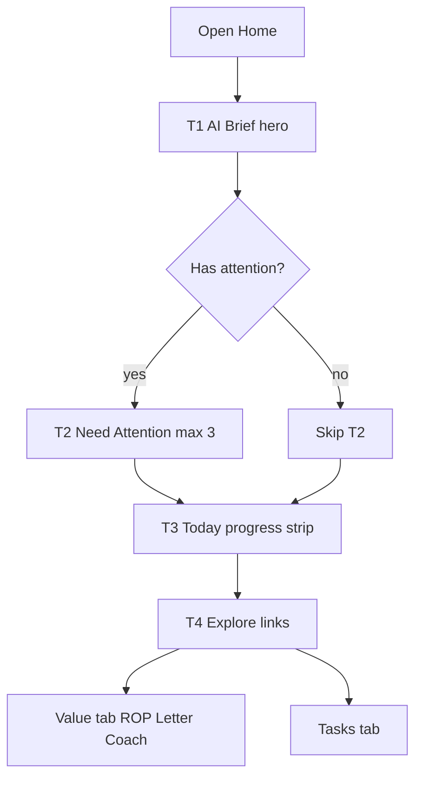

# P0 Parent Home Brief

**Mã:** KIT-UX-FO-HOME-BRIEF-P0 · **Ngày:** 2026-07-27  
**Trạng thái:** IMPLEMENTED + **P0.5** (local) · 2026-07-27  
**Phụ thuộc:** Parent Pulse, Coach SoT, attentionItems, commercial packaging (paywall không chiếm Tầng 1)

## Goal

Home trả lời **3 câu trong ~30 giây** (không còn dashboard dài):

1. Gia đình hôm nay thế nào?
2. Có việc cần làm ngay không?
3. Famixa cho phụ huynh điều gì hôm nay?

Triết lý: **Morning/Evening Briefing**, không Web Dashboard.  
SoT hiện có: `buildParentPulse`, `resolveParentCoach`, `attentionItems` trong `ParentBoardView.tsx`.

## P0.5 siết (2026-07-27)

| Gap P0 | Fix P0.5 |
|--------|----------|
| Brief vẫn ưu tiên Coach khi Attention đầy | `primaryAction.kind=attention` khi `topAttention` có; mood đổi theo số việc |
| CTA “Làm theo / Xem lý do” cùng mở coach | Attention → verify / Tasks; evening → `#fv-3q`; coach → sheet |
| Hint 3Q / chip ROP chỉ `setTab('value')` | `goValueAnchor('fv-3q' \| 'fv-rop' \| 'fv-ai-letter')` + scroll |
| 3Q bị gỡ khỏi Home, Value chưa có surface | `#fv-3q` evening check-in trên `FamilyValuePanel` |
| Tối không có việc | `primaryAction.kind=evening_checkin` nếu chưa nộp 3Q |

## P0 scope (khóa)

### In

- Restructure `tab === 'home'` trong [`ParentBoardView.tsx`](../../client/family-app/src/modules/flow/ParentBoardView.tsx)
- Helper `buildHomeBrief` (rule/template; morning vs evening theo giờ)
- Attention chỉ khi có việc (max 3)
- Routine = 1 progress strip → tap mở tab Tasks
- ROP / Wins / Letter / Twin / Achievements / Replay **không** stack trên Home (giữ Value / Explore links)
- BillingBanner: giữ dưới Brief; không đẩy paywall vào hero Brief

### Out

- LLM / free-form chat
- Redesign tab Value / Tasks / Rewards
- API / migration mới
- Deploy pilot / Pharmacy
- Full brand visual overhaul (chỉ hierarchy + density)

## Architecture

### Tầng 1 — AI Brief (~250–300px)

Một hero (không 5 card):

- Greeting + mood 1 dòng (`dayMoodVi` / peace) — **override** khi có Attention
- 2–3 bullet ngắn từ pulse (nudge / autonomy / 1 win)
- **Một** hành động chính theo ưu tiên: Attention → 3Q (tối) → Coach tip
- Morning (&lt; 17:00 local): “Hôm nay cần lưu ý…” + action  
- Evening: “Hôm nay nhà tiến bộ…” + CTA/hint 3Q nếu chưa làm

### Tầng 2 — Need Attention

Reuse `attentionItems` (awaiting / overdue / consequence), max 3, CTA hiện có. Empty → ẩn cả section.

### Tầng 3 — Today Progress

Một strip: `done/total` + bar % + “Xem missions →” (`setTab('tasks')`). Không list từng commitment trên Home.

### Tầng 4 — Khám phá

Hàng chip/link: Famixa đồng hành · Growth Report (`#fv-rop`) · Letter (`#fv-ai-letter`) · 3 câu tối (`#fv-3q`) · Nhiệm vụ.

## Implementation steps

1. **`client/family-app/src/shared/value/home-brief.ts`** — P0.5 kinds + Attention-first.
2. **Refactor home JSX** — Brief → Attention → Progress → Explore; deep-link helpers.
3. **Value `#fv-3q`** — evening check-in surface cho deep-link.
4. **Verify** — DEMO: Attention đầy → Brief CTA verify/Tasks; chip ROP/3Q scroll; `tsc` OK.
5. **Doc** — PSE + plan này.

## Acceptance

| Check | Pass |
|-------|------|
| First viewport = Brief + 1 primary CTA | |
| Attention có → Brief ưu tiên việc nóng (không coach) | |
| Deep-link 3Q / ROP scroll đúng anchor | |
| Không list full commitments trên Home | |
| Attention ẩn khi empty | |
| ROP/Letter/Wins không auto-stack trên Home | |
| Coach / capability paywall vẫn hoạt động | |
| `tsc` family-app OK | |

## Follow-ups (không P0.5)

- **P1:** Family Feed chỉ khi có event mới hôm nay  
- **P2:** Brief lấy Memory win trong ngày (“lần đầu tự học”)  
- **P3:** Coach Act Rate / `parent_coach_acted`

## Quyết định mặc định (đã khóa trong plan)

P0 = **restructure + morning/evening copy** từ pulse/coach hiện có — **không** API mới, **không** full tab redesign.  
P0.5 = **ưu tiên Attention + deep-link** — vẫn không API mới.
